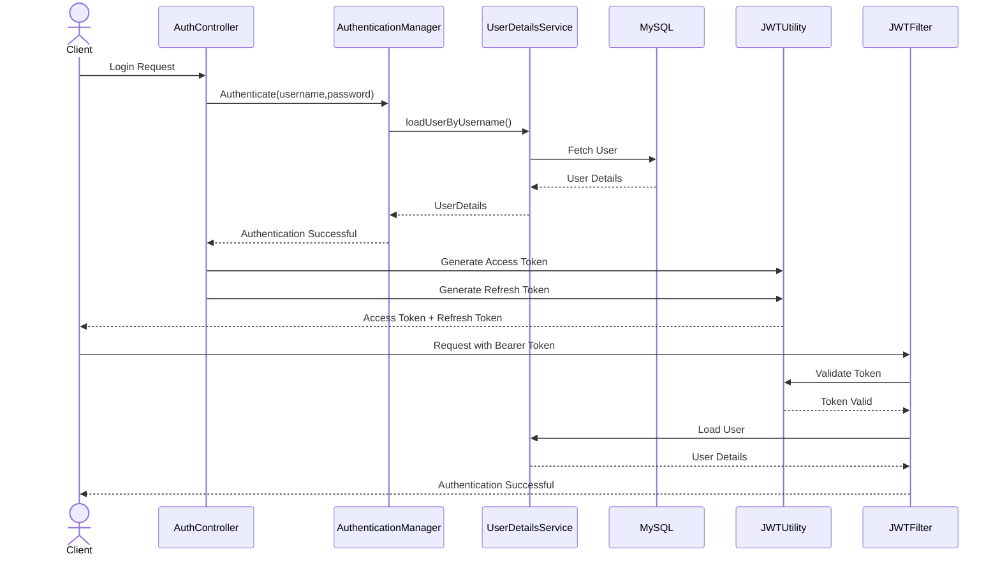

<div align="center">

# 🔐 AuthGuard - JWT Authentication


<br>


### Secure Authentication & Authorization using Spring Security 6 and JWT

</div>

---

# 📖 Overview

This project is a complete implementation of **Spring Security 6** using **JWT (JSON Web Tokens)** to build secure, stateless REST APIs.

It demonstrates modern authentication practices including **JWT Access Tokens**, **Refresh Tokens**, **BCrypt Password Encryption**, **Spring Security Filters**, and **MapStruct DTO Mapping** while following a clean layered architecture.

The primary objective of this project is to understand how authentication works internally in Spring Security and implement a scalable backend security architecture.

---

# ✨ Features

* 🔐 User Registration
* 🔑 User Login
* 🎫 JWT Access Token
* 🔄 JWT Refresh Token
* 🛡️ Stateless Authentication
* 🔒 BCrypt Password Encryption
* 👤 Custom UserDetailsService
* ⚡ JWT Authentication Filter (`OncePerRequestFilter`)
* 📦 DTO Pattern
* 🗂️ DTO Mapping using MapStruct
* 📑 Bean Validation
* ⚠️ Global Exception Handling
* 💾 MySQL Integration
* 🏛️ Layered Architecture
* 🧹 Clean Code Structure

---

# 🛠️ Tech Stack

| Category       | Technology                  |
| -------------- | --------------------------- |
| Language       | Java 17                     |
| Framework      | Spring Boot 3               |
| Security       | Spring Security 6           |
| Authentication | JWT                         |
| ORM            | Spring Data JPA + Hibernate |
| Database       | MySQL                       |
| DTO Mapping    | MapStruct                   |
| Build Tool     | Maven                       |
| API Testing    | Postman , SwaggerOpenAPI                    |
| IDE            | IntelliJ IDEA               |

---

# 📂 Project Structure

```text
src
│
├── config
├── controller
├── dto
├── entity
├── exception
├── mapper
├── repository
├── security
├── service
├── util
└── resources
```

---


# 🔐 JWT Authentication Flow



---

# 📌 Authentication Endpoints

| Method | Endpoint              | Description                               |
| ------ | --------------------- | ----------------------------------------- |
| POST   | `/auth/register`      | Register a new user                       |
| POST   | `/auth/login`         | Authenticate user and generate JWT tokens |
| POST   | `/auth/refresh-token` | Generate a new Access Token               |

> **Note:** Additional protected business APIs will be introduced as role-based authorization is implemented.

---

# 📚 Concepts Implemented

* ✅ Spring Boot 3
* ✅ Spring Security 6
* ✅ JWT Authentication
* ✅ Access Token
* ✅ Refresh Token
* ✅ AuthenticationManager
* ✅ SecurityFilterChain
* ✅ OncePerRequestFilter
* ✅ Custom UserDetailsService
* ✅ UserDetails
* ✅ SecurityContextHolder
* ✅ BCrypt Password Encoder
* ✅ Spring Data JPA
* ✅ Hibernate
* ✅ MapStruct
* ✅ DTO Pattern
* ✅ Bean Validation
* ✅ REST APIs
* ✅ Global Exception Handling
* ✅ MySQL
* ✅ Maven

---

# 🚧 Currently Building

* 👥 Role-Based Authorization (USER / ADMIN)
* 📧 Email Verification
* 🔑 Forgot Password / Password Reset
* 🌐 OAuth2 Login (Google & GitHub)

---

# 🔮 Future Improvements

* 🚀 Redis Token Blacklisting
* 📖 Swagger / OpenAPI Documentation
* 🐳 Docker & Docker Compose
* ⚙️ GitHub Actions (CI/CD)
* 🧪 Unit & Integration Testing

---

# ▶️ Getting Started

### Clone the Repository

```bash
  https://github.com/radhikadhyani/SpringSecurity.git

```

### Navigate to the Project

```bash
https://github.com/radhikadhyani/SpringSecurity

```

### Configure Database

Update your `application.properties` with your MySQL credentials.

### Run the Project

```bash
mvn spring-boot:run
```

---

# 🎯 Learning Objectives

This project focuses on understanding:

* Spring Security Authentication Flow
* Stateless Authentication
* JWT Generation & Validation
* Refresh Token Mechanism
* Spring Security Filter Chain
* AuthenticationManager
* UserDetailsService
* Password Encryption
* DTO Mapping with MapStruct
* Secure REST API Development

---

# 🤝 Contributing

Contributions are welcome.

If you have suggestions or improvements:

* ⭐ Star the repository
* 🍴 Fork the repository
* 🐞 Open an Issue
* 🚀 Submit a Pull Request

---

<div align="center">

### 🔐 Secure APIs • ☕ Clean Code • 🚀 Keep Learning

**Built with ❤️ using Java, Spring Boot 3, Spring Security 6 & JWT**

</div>
